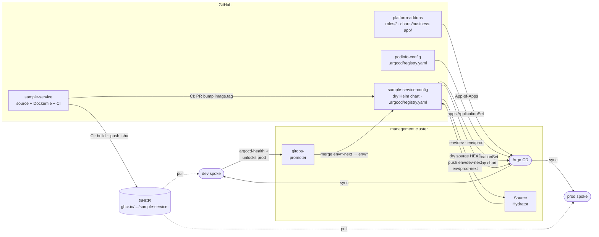

# CLAUDE.md

This file provides guidance to Claude Code (claude.ai/code) when working with code in this repository.

## Delivery pipeline

## Architecture

`sample-service-config` is the dry source repo for sample-service. It self-registers via `.argocd/registry.yaml`, which the `promoter` ApplicationSet reads to render `platform-addons/charts/business-app/` — a platform Helm chart that generates:

- `sample-service-dev`, `sample-service-prod` — Argo CD Applications with `sourceHydrator`
- `GitRepository`, `PromotionStrategy`, `ArgoCDCommitStatus` — gitops-promoter CRs

No hand-written `config/` directory. Everything is generated by the platform chart from the registry values.

- `.argocd/registry.yaml` — self-registration (name, repoUrl, chartPath, namespace, githubOwner, githubName, environment[]{env, valuesFile, autoMerge})
- `chart/` — dry Helm source. Argo CD Source Hydrator renders this against `chart/env/<env>/values.yaml` and pushes plain YAML to `env/<env>-next` branches.

## Branch model

| Branch | Managed by | Purpose |
|---|---|---|
| `main` | Authors / CI | Dry source — Helm chart + values |
| `env/dev-next` | Source Hydrator | Proposed hydrated manifests for dev |
| `env/dev` | gitops-promoter | Active dev delivery |
| `env/prod-next` | Source Hydrator | Proposed hydrated manifests for prod |
| `env/prod` | gitops-promoter | Active prod delivery |

Do **not** delete `env/*` or `env/*-next` branches on PR merge.

## Key conventions

- **Never use `destination.server`** — always `destination.name` (`dev`, `prod`, or `in-cluster`).
- To change deployment targets, chart path, namespace, or promotion behaviour, edit `.argocd/registry.yaml` — the platform chart picks up the change on next Argo CD sync.
- `autoMerge: false` on an environment means gitops-promoter opens a PR but waits for manual approval before merging `env/*-next` → `env/*`.
- The image tag lives in `chart/values.yaml` (shared base) — CI bumps it here so one dry SHA promotes through all envs in order.
- **Argo CD Source Hydrator stuck after `main` push**: the hydrator only runs on Application *creation*. After the first run, the app-controller only polls `env/dev`/`env/prod` — it never re-checks `main` without a GitHub webhook. Fix: delete and let the parent recreate the Applications: `kubectl --context k3d-management -n argocd delete application sample-service-dev sample-service-prod --wait=false`
- **gitops-promoter stale secret**: if `ChangeTransferPolicy` shows "Secret not found" after `github-app-credentials` exists, restart the controller: `kubectl --context k3d-management -n promoter-system rollout restart deployment/promoter-controller-manager`.
