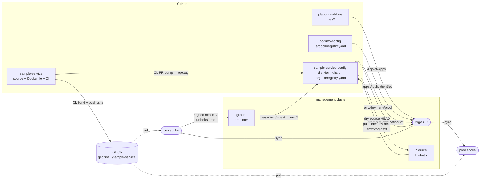

# CLAUDE.md

This file provides guidance to Claude Code (claude.ai/code) when working with code in this repository.

## Delivery pipeline

## Architecture

`sample-service-config` is the dry source repo for sample-service. It self-registers via `.argocd/registry.yaml`, which the `promoter` ApplicationSet in `platform-control-plane` reads to generate `sample-service-promoter-config` — a wrapper Application that recurse-syncs `config/` to the management cluster.

- `.argocd/registry.yaml` — self-registration (name, repoUrl, configPath)
- `chart/` — dry Helm source. Argo CD Source Hydrator renders this against `chart/env/<env>/values.yaml` and pushes plain YAML to `env/<env>-next` branches.
- `config/apps/` — Argo CD Applications (`app-dev.yaml`, `app-prod.yaml`) with `spec.sourceHydrator`. Synced to management by `sample-service-promoter-config`.
- `config/promoter/` — gitops-promoter CRs (`GitRepository`, `PromotionStrategy`, `ArgoCDCommitStatus`). Also synced by `sample-service-promoter-config`.

## Branch model

| Branch | Managed by | Purpose |
|---|---|---|
| `main` | Authors / CI | Dry source — Helm chart + values |
| `env/dev-next` | Source Hydrator | Proposed hydrated manifests for dev |
| `env/dev` | gitops-promoter | Active dev delivery |
| `env/prod-next` | Source Hydrator | Proposed hydrated manifests for prod |
| `env/prod` | gitops-promoter | Active prod delivery |

Do **not** delete `env/*` or `env/*-next` branches on PR merge.

## Key conventions

- **Never use `destination.server`** — always `destination.name` (`dev`, `prod`, or `in-cluster`).
- To change where `config/` is synced or which configPath is used, edit `.argocd/registry.yaml` (not any file in `platform-apps`).
- `config/` resources declare their own `namespace` in metadata (`argocd` for Applications, `promoter-system` for promoter CRs) — the parent Application uses `destination.namespace: argocd` only as a default.
- The image tag lives in `chart/values.yaml` (shared base) — CI bumps it here so one dry SHA promotes through all envs in order.
- **Argo CD Source Hydrator cache issue**: if the hydrator loops silently after a `main` push, restart Redis (`kubectl rollout restart deployment/argocd-redis -n argocd`) then annotate the Application with `hydrate=hard`.
- **gitops-promoter stale secret**: if `ChangeTransferPolicy` shows "Secret not found" after `github-app-credentials` exists, restart the controller: `kubectl --context k3d-management -n promoter-system rollout restart deployment/promoter-controller-manager`.
