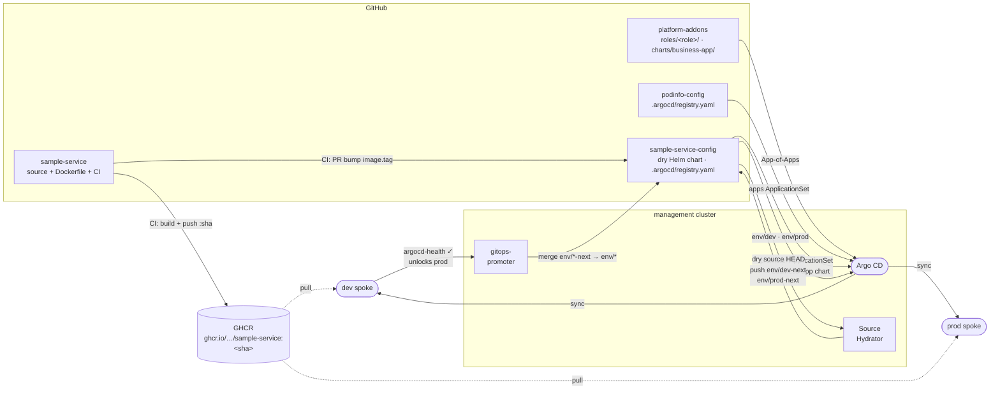

# sample-service-config

The complete delivery config for `sample-service`. This repo owns:

- **`.argocd/registry.yaml`** — self-registration for the `promoter` ApplicationSet. The platform reads this file and generates everything else automatically.
- **`chart/`** — dry Helm source. The Argo CD Source Hydrator renders it and pushes plain YAML to `env/*-next` branches.

That's it. No `config/` directory. The Argo CD Applications and gitops-promoter CRs are generated by the platform's `business-app` Helm chart (`platform-addons/charts/business-app/`) — the `promoter` ApplicationSet passes values from `.argocd/registry.yaml` into that chart.

CI from `sample-service` opens PRs here to bump the image tag; the promoter drives those changes through dev → prod via pull requests.

## How it fits in

This repo self-registers by shipping `.argocd/registry.yaml`. The `promoter` ApplicationSet in `platform-control-plane` reads that file and renders `platform-addons/charts/business-app/` with values from it, generating:
- `sample-service-dev` and `sample-service-prod` — Argo CD Applications with `sourceHydrator`
- `GitRepository`, `PromotionStrategy`, `ArgoCDCommitStatus` — gitops-promoter CRs

All synced to the management cluster under the `sample-service-promoter-config` wrapper Application.

## `.argocd/registry.yaml`

```yaml
name: sample-service
repoUrl: https://github.com/platform-engineer-lab/sample-service-config
chartPath: chart
namespace: sample-service
githubOwner: platform-engineer-lab
githubName: sample-service-config
environment:
  - env: dev
    valuesFile: env/dev/values.yaml
    autoMerge: true
  - env: prod
    valuesFile: env/prod/values.yaml
    autoMerge: true    # set to false to require manual PR approval for prod
```

`autoMerge: true` lets gitops-promoter merge `env/*-next` → `env/*` automatically. Set it to `false` on prod to require a manual PR review before promotion.

## Branch model

| Branch | Role | Who touches it |
|---|---|---|
| `main` | Dry source — Helm chart + values | Authors / CI |
| `env/dev-next` | Hydrated proposals for dev | Argo CD Source Hydrator |
| `env/dev` | Active dev delivery | gitops-promoter (merges `env/dev-next`) |
| `env/prod-next` | Hydrated proposals for prod | Argo CD Source Hydrator |
| `env/prod` | Active prod delivery | gitops-promoter (merges `env/prod-next`) |

`env/*-next` and `env/*` branches are managed automatically. Do **not** delete them on PR merge — configure the repo to disable branch auto-deletion or add branch protection rules matching `env/*-next`.

## Promotion flow



## First-run prerequisites

Before the first promotion can go **green**, two things must be true:

1. **A real image must exist in GHCR.** `chart/values.yaml` ships `image.tag: latest`, but CI only ever publishes immutable `:<sha>` tags. On the first `make up`, pods hit `ImagePullBackOff`, dev never reports healthy, and the `argocd-health` gate stays red. Fix: trigger the `sample-service` CI at least once first, then seed `chart/values.yaml` `image.tag` with the published SHA before running `make up`.

2. **The GHCR package must be public** (or the spoke clusters need an `imagePullSecret`). New GHCR packages default to private.

## Required secrets (manual — not in git)

### 1. GitHub App for gitops-promoter (in `promoter-system` on the management cluster)

Create a GitHub App with **Contents** read/write, **Pull requests** read/write, **Checks** write. Install it on this repo and on `sample-service`. Then:

```bash
kubectl --context k3d-management create secret generic github-app-credentials \
  --namespace promoter-system \
  --from-literal=githubAppPrivateKey="$(cat /path/to/private-key.pem)"
```

Update `platform-addons/manifests/gitops-promoter/scm-provider.yaml` with the real `appID`, then push.

> **Note:** if `ChangeTransferPolicy` shows "Secret not found" after the secret is created, restart the controller: `kubectl --context k3d-management -n promoter-system rollout restart deployment/promoter-controller-manager`

### 2. Argo CD repo write credential (hydrator pushes to `env/*-next`)

```bash
kubectl --context k3d-management apply -f - <<EOF
apiVersion: v1
kind: Secret
metadata:
  name: repo-write-sample-service-config
  namespace: argocd
  labels:
    argocd.argoproj.io/secret-type: repository-write
stringData:
  url: https://github.com/platform-engineer-lab/sample-service-config
  username: git
  password: <github-pat-with-contents-write>
EOF
```

### 3. CI GitHub App secrets in `sample-service` repo

| Secret | Value |
|---|---|
| `APP_ID` | GitHub App ID |
| `APP_PRIVATE_KEY` | Contents of the `.pem` private key file |

## Repository layout

```
.argocd/
  registry.yaml             self-registration — read by the promoter ApplicationSet

chart/
  Chart.yaml
  values.yaml               base values — image.tag lives here (CI bumps this)
  templates/                Deployment, Service
  env/
    dev/values.yaml         dev overrides (replicaCount, etc.)
    prod/values.yaml        prod overrides
```

The platform (`platform-addons/charts/business-app/`) generates all Argo CD Applications and gitops-promoter CRs from `.argocd/registry.yaml` — no `config/` directory needed.

## Local chart validation

```bash
helm template sample-service chart -f chart/env/dev/values.yaml
helm template sample-service chart -f chart/env/prod/values.yaml
```
