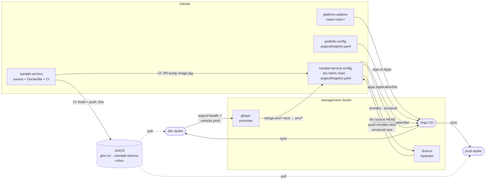

# sample-service-config

The complete delivery config for `sample-service`. This repo owns:

- **`.argocd/registry.yaml`** — self-registration for the `promoter` ApplicationSet.
- **`chart/`** — dry Helm source. The Argo CD Source Hydrator renders it and pushes plain YAML to `env/*-next` branches.
- **`config/apps/`** — Argo CD Applications (`app-dev.yaml`, `app-prod.yaml`) with `spec.sourceHydrator`. Synced to the management cluster by the `promoter` ApplicationSet.
- **`config/promoter/`** — gitops-promoter CRs (`GitRepository`, `PromotionStrategy`, `ArgoCDCommitStatus`). Also synced by `promoter`.

CI from `sample-service` opens PRs here to bump the image tag; the promoter drives those changes through dev → prod via pull requests.

## How it fits in

This repo self-registers by shipping `.argocd/registry.yaml`. The `promoter` ApplicationSet in `platform-control-plane` reads that file and generates `sample-service-promoter-config` — a wrapper Application that recurse-syncs `config/` to the management cluster, bringing `config/apps/` and `config/promoter/` under GitOps control.

## `.argocd/registry.yaml`

```yaml
name: sample-service
repoUrl: https://github.com/platform-engineer-lab/sample-service-config
configPath: config
```

## Branch model

| Branch | Role | Who touches it |
|---|---|---|
| `main` | Dry source — Helm chart + values | Authors / CI |
| `env/dev-next` | Hydrated proposals for dev | Argo CD Source Hydrator |
| `env/dev` | Active dev delivery | gitops-promoter (merges `env/dev-next`) |
| `env/prod-next` | Hydrated proposals for prod | Argo CD Source Hydrator |
| `env/prod` | Active prod delivery | gitops-promoter (merges `env/prod-next`) |

`env/*-next` and `env/*` branches are managed automatically. Do **not** delete them on PR merge — configure the repo to disable branch auto-deletion or add branch protection rules matching `env/*-next`.

## Promotion flow



## First-run prerequisites

Before the first promotion can go **green**, two things must be true:

1. **A real image must exist in GHCR.** `chart/values.yaml` ships `image.tag: latest`, but CI only ever publishes immutable `:<sha>` tags — `:latest` is never pushed. On the first `make up`, before any CI run, pods hit `ImagePullBackOff`, dev never reports healthy, and the `argocd-health` gate stays red (hydration still works — rendering doesn't pull). Fix: trigger the `sample-service` CI at least once first, then seed `chart/values.yaml` `image.tag` with the published SHA before running `make up`.

2. **The GHCR package must be public** (or the spoke clusters need an `imagePullSecret`). New GHCR packages default to private. Go to `https://github.com/orgs/platform-engineer-lab/packages` → package settings → make public.

## Required secrets (manual — not in git)

### 1. GitHub App for gitops-promoter (in `promoter-system` on the management cluster)

Create a GitHub App with:
- **Contents:** read/write
- **Pull requests:** read/write
- **Checks:** write  ← gitops-promoter uses the Check Runs API, not the Commit Statuses API

Install it on this repo (`sample-service-config`) and on `sample-service`. Note the `appID` and `installationID`, then:

```bash
kubectl --context k3d-management create secret generic github-app-credentials \
  --namespace promoter-system \
  --from-literal=githubAppPrivateKey="$(cat /path/to/private-key.pem)"
```

Update `platform-addons/manifests/gitops-promoter/scm-provider.yaml` with the real `appID`, then push to trigger Argo CD sync.

> **Note:** if `ChangeTransferPolicy` shows "Secret not found" after the secret is created, restart the controller: `kubectl --context k3d-management -n promoter-system rollout restart deployment/promoter-controller-manager`

### 2. Argo CD repo write credential (hydrator pushes to `env/*-next`)

The Argo CD Source Hydrator needs write access to this repo. The secret **must** use `secret-type: repository-write` — the hydrator calls `GetWriteRepository()` which queries a separate backend from the normal read credential.

```bash
kubectl --context k3d-management apply -f - <<EOF
apiVersion: v1
kind: Secret
metadata:
  name: repo-write-sample-service-config
  namespace: argocd
  labels:
    argocd.argoproj.io/secret-type: repository-write
stringData:
  url: https://github.com/platform-engineer-lab/sample-service-config
  username: git
  password: <github-pat-with-contents-write>
EOF
```

### 3. CI GitHub App secrets in `sample-service` repo

CI uses a GitHub App to open PRs into this repo. Add two secrets on the `sample-service` repository:

| Secret | Value |
|---|---|
| `APP_ID` | GitHub App ID (e.g. `4117391`) |
| `APP_PRIVATE_KEY` | Contents of the downloaded `.pem` private key file |

## Repository layout

```
.argocd/
  registry.yaml             self-registration — read by the promoter ApplicationSet

chart/
  Chart.yaml
  values.yaml               base values — image.tag lives here (CI bumps this)
  templates/                Deployment, Service
  env/
    dev/values.yaml         dev overrides (replicaCount, etc.)
    prod/values.yaml        prod overrides

config/
  apps/
    app-dev.yaml            Argo CD Application (sourceHydrator → env/dev, destination: dev spoke)
    app-prod.yaml           Argo CD Application (sourceHydrator → env/prod, destination: prod spoke)
  promoter/
    git-repository.yaml     GitRepository CR (points at this repo)
    promotion-strategy.yaml PromotionStrategy CR (dev → prod, gated on argocd-health)
    argocd-commit-status.yaml ArgoCDCommitStatus CR (maps Argo CD health to argocd-health key)
```

`config/` is synced to the management cluster by the `sample-service-promoter-config` Application, generated by the `promoter` ApplicationSet reading `.argocd/registry.yaml` from this repo.

## Local chart validation

```bash
helm template sample-service chart -f chart/env/dev/values.yaml
helm template sample-service chart -f chart/env/prod/values.yaml
```
