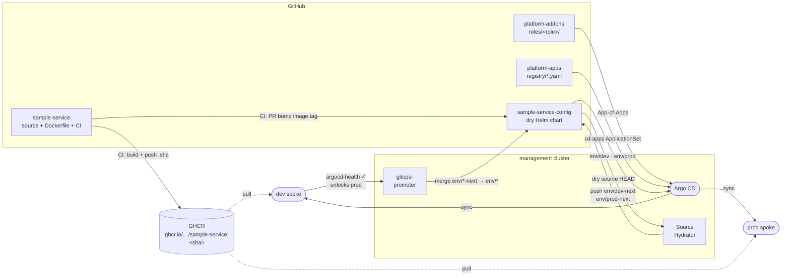

# sample-service-config

Helm chart + values for `sample-service`. This is the **dry source** repo watched by
gitops-promoter; CI from `sample-service` opens PRs here to bump the image tag, and
the promoter drives those changes through dev → prod via pull requests.

## Branch model

| Branch | Role | Who touches it |
|---|---|---|
| `main` | Dry source — Helm chart + values | Authors / CI |
| `env/dev-next` | Hydrated proposals for dev | Argo CD Source Hydrator |
| `env/dev` | Active dev delivery | gitops-promoter (merges `env/dev-next`) |
| `env/prod-next` | Hydrated proposals for prod | Argo CD Source Hydrator |
| `env/prod` | Active prod delivery | gitops-promoter (merges `env/prod-next`) |

`env/*-next` and `env/*` branches are managed automatically. Do **not** delete them
on PR merge — configure the repo to disable branch auto-deletion or add branch
protection rules matching `env/*-next`.

## Promotion flow



## First-run prerequisites

Before the first promotion can go **green**, two things must be true:

1. **A real image must exist in GHCR.** `chart/values.yaml` ships `image.tag: latest`, but
   CI only ever publishes immutable `:<sha>` tags — `:latest` is never pushed. On the first
   `make up`, before any CI run, pods hit `ImagePullBackOff`, dev never reports healthy, and
   the `argocd-health` gate stays red (hydration still works — rendering doesn't pull).
   Fix: trigger the `sample-service` CI at least once first, then seed `chart/values.yaml`
   `image.tag` with the published SHA before running `make up`.

2. **The GHCR package must be public** (or the spoke clusters need an `imagePullSecret`).
   New GHCR packages default to private. Go to
   `https://github.com/orgs/platform-engineer-lab/packages` → package settings → make public.

## Required secrets (manual — not in git)

### 1. GitHub App for gitops-promoter (in `promoter-system` on the management cluster)

Create a GitHub App with:
- **Contents:** read/write
- **Pull requests:** read/write
- **Checks:** write  ← gitops-promoter uses the Check Runs API, not the Commit Statuses API

Install it on this repo (`sample-service-config`) and on `sample-service`.
Note the `appID` and `installationID`, then:

```bash
kubectl --context k3d-management create secret generic github-app-credentials \
  --namespace promoter-system \
  --from-literal=githubAppPrivateKey="$(cat /path/to/private-key.pem)"
```

Update `platform-addons/manifests/gitops-promoter/scm-provider.yaml` with the real
`appID` (and optionally `installationID`), then push to trigger Argo CD sync.

### 2. Argo CD repo write credential (hydrator pushes to `env/*-next`)

The Argo CD Source Hydrator needs write access to this repo to push hydrated manifests.
The secret **must** use `secret-type: repository-write` — the hydrator calls
`GetWriteRepository()` which queries a separate backend from the normal read credential.
A `repository` (read) secret will not work and the hydrator will silently fall back to
no-credential mode, causing `git push` to fail.

```bash
kubectl --context k3d-management apply -f - <<EOF
apiVersion: v1
kind: Secret
metadata:
  name: repo-write-sample-service-config
  namespace: argocd
  labels:
    argocd.argoproj.io/secret-type: repository-write
stringData:
  url: https://github.com/platform-engineer-lab/sample-service-config
  username: git
  password: <github-pat-with-contents-write>
EOF
```

### 3. CI GitHub App secrets in `sample-service` repo

CI uses a GitHub App (the same one as gitops-promoter) to open PRs into this repo.
Add two secrets on the `sample-service` repository:

| Secret | Value |
|---|---|
| `APP_ID` | GitHub App ID (e.g. `4117391`) |
| `APP_PRIVATE_KEY` | Contents of the downloaded `.pem` private key file |

The App must be installed on both `sample-service` and `sample-service-config` with
**Contents: read/write** and **Pull requests: read/write** permissions.

## Local chart validation

```bash
helm template sample-service chart -f chart/env/dev/values.yaml
helm template sample-service chart -f chart/env/prod/values.yaml
```
